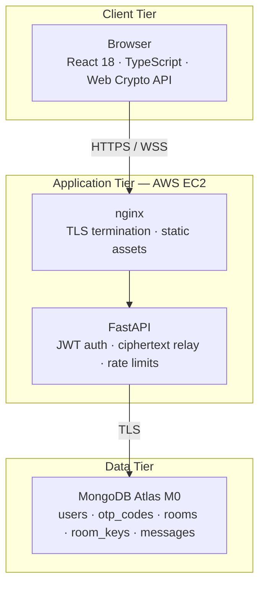
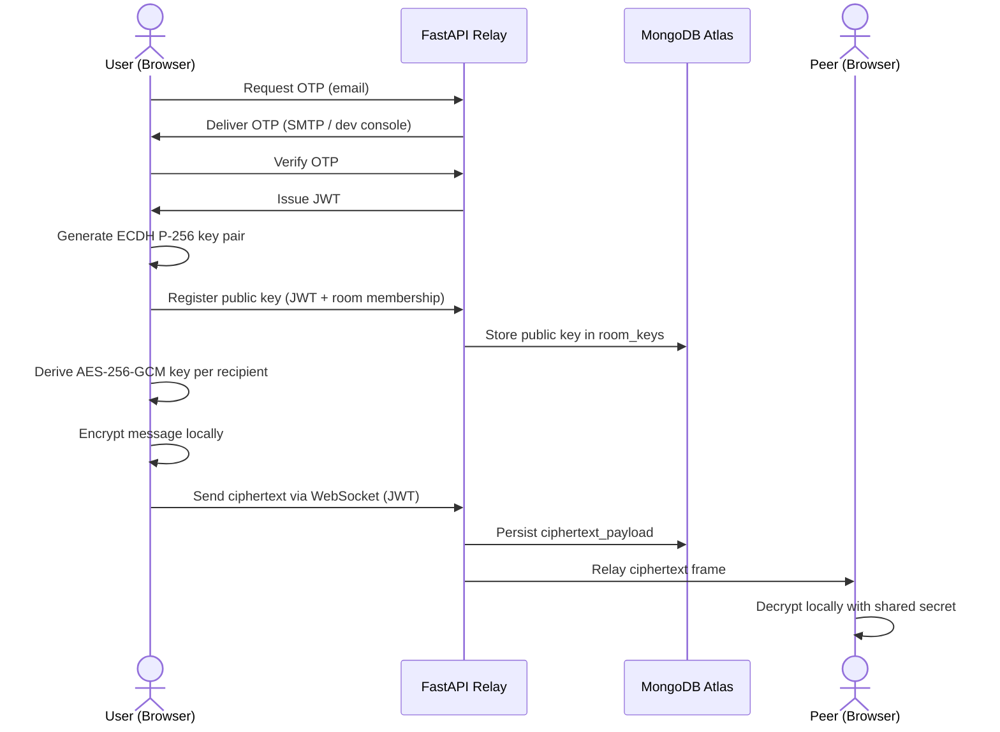

# StudySafe

[](https://github.com/Sireesha-Boyapati/Secure-Communications-Collaboration-System-Design-and-Deployment/actions)

**End-to-end encrypted realtime messaging platform for secure student team collaboration.**

| | |
|---|---|
| **Live application** | https://16.16.138.41 |
| **API documentation** | https://16.16.138.41/docs |
| **Team** | Mahendra · Sireesha · Oree · Sudheer |
| **Team workspace** | [DBS SharePoint — MoM & recordings](https://mydbs-my.sharepoint.com/shared?ga=1&id=%2Fpersonal%2F20097954%5Fmydbs%5Fie%2FDocuments%2Fca%20project%20security&listurl=%2Fpersonal%2F20097954%5Fmydbs%5Fie%2FDocuments) |

> **Note:** Production uses HTTPS with a self-signed certificate. Accept the browser security warning once to enable the Web Crypto API.

---

## Executive Summary

StudySafe addresses a common gap in student project coordination: mainstream chat tools store messages in plaintext on third-party servers and cannot guarantee confidentiality if the relay is compromised.

StudySafe enforces confidentiality through **client-side cryptography**. Messages are encrypted in the browser before transmission. The FastAPI backend and MongoDB Atlas database persist **ciphertext only** — private keys never leave the user's device. Even a full server or database breach does not expose readable message content.

**Core capabilities**

| Domain | Capability |
|--------|------------|
| Identity | Passwordless email OTP authentication; JWT session tokens (HS256, 60-minute TTL) |
| Access control | Invite-only rooms with 6-character alphanumeric codes; JWT enforced on REST and WebSocket |
| Encryption | ECDH P-256 key agreement + AES-256-GCM via Web Crypto API; SHA-256 key fingerprints |
| Realtime | Authenticated WebSocket relay; presence and typing indicators (ephemeral) |
| Operations | Docker Compose on AWS EC2; Gmail SMTP for OTP; GitHub Actions CI |

**Design invariant:** Plaintext must never reach the backend or database.

---

## System Architecture & Cryptographic Workflow

### Deployment topology



### Component responsibilities

| Tier | Component | Responsibility |
|------|-----------|------------------|
| Client | React SPA | OTP login, key generation, encrypt/decrypt, WebSocket client |
| Client | Web Crypto API | ECDH P-256 key pairs; AES-256-GCM message encryption |
| Client | sessionStorage | Private keys persisted per room for the browser session |
| Compute | nginx | HTTPS termination, reverse proxy, React production build |
| Compute | FastAPI | JWT validation, public-key registry, ciphertext store and relay |
| Data | MongoDB Atlas | Persistent storage; message bodies stored as ciphertext JSON |

### End-to-end message flow



### Cryptographic workflow

1. **Authentication** — User submits email; server generates a time-limited OTP (6 digits, 10-minute expiry). On verification, server issues a JWT (HS256, 60-minute expiry).
2. **Room access** — User creates or joins a room via a random 6-character invite code. Membership is validated on every API and WebSocket request.
3. **Key establishment** — Browser generates an ECDH P-256 key pair per room session. Public key is registered with the server; private key remains in `sessionStorage`.
4. **Shared secret derivation** — For each recipient, sender performs ECDH with the recipient's registered public key and derives an AES-256-GCM key.
5. **Message encryption** — Plaintext is encrypted locally. The payload includes per-recipient ciphertext and metadata (sender, timestamp).
6. **Relay and storage** — Server stores and forwards ciphertext without decryption capability. Peers decrypt on receipt using their private keys.

**Out-of-band verification:** Users compare SHA-256 key fingerprints via a secondary channel (e.g. Zoom or phone) to detect man-in-the-middle key substitution.

---

## Technology Stack

| Layer | Technology | Version / Detail |
|-------|------------|------------------|
| Frontend | React, TypeScript, Vite | React 18 |
| Cryptography | Web Crypto API | ECDH P-256, AES-256-GCM, SHA-256 |
| Backend | Python, FastAPI, Motor | Python 3.12; async MongoDB driver |
| Authentication | Email OTP, JWT | python-jose; HS256; 60-minute token TTL |
| Realtime | WebSocket | JWT-authenticated; presence, typing, message relay |
| Database | MongoDB Atlas | M0 free tier |
| Email | Gmail SMTP | Production OTP delivery; console log in development |
| Infrastructure | AWS EC2, Docker Compose, nginx | t2.micro; self-signed TLS for demo |
| CI/CD | GitHub Actions | pytest, vitest, production build on every push to `main` |

---

## Threat Modeling & Security Controls

StudySafe assumes the application server and database may be targeted. The security objective is **damage limitation**: a compromised relay must not yield readable messages.

### Security control matrix

| Layer | Control | Implementation |
|-------|---------|----------------|
| Transport | TLS encryption | HTTPS / WSS on EC2 via nginx |
| Authentication | Passwordless OTP + JWT | 6-digit OTP (10-min expiry); JWT HS256 (60-min TTL) |
| Authorization | Room-scoped access | Membership validated on REST and WebSocket |
| Encryption | End-to-end messaging | AES-256-GCM; private keys client-only |
| Input validation | Schema enforcement | Pydantic models on all API request bodies |
| Abuse prevention | Rate limiting | slowapi — 60 requests/minute default; OTP endpoint throttled |
| Payload limits | DoS mitigation | 64 KB cap on WebSocket frames and stored ciphertext |
| HTTP hardening | Response headers | X-Frame-Options, X-Content-Type-Options, and related headers |
| Reconnaissance | Honeypot decoy | `/api/admin/*` returns fake data and logs probe attempts |
| Secrets management | Environment isolation | `.env` gitignored; JWT secret and DB URI excluded from source |

### Threat scenarios and mitigations

| Threat | Impact | Mitigation |
|--------|--------|------------|
| Server or database breach | Attacker exfiltrates stored data | Only ciphertext and metadata persisted; private keys remain in user browsers |
| Network man-in-the-middle | Attacker substitutes public keys | SHA-256 fingerprint verification on an independent channel |
| Stolen JWT | Session impersonation | Short token TTL; room membership enforced; historical messages require browser keys |
| OTP brute force | Unauthorized account access | Rate limiting, OTP expiry, capped failed attempts |
| WebSocket hijacking | Unauthorized realtime access | JWT validation and room membership check before socket acceptance |
| API flooding / DoS | Service degradation | slowapi rate limits; 64 KB payload size caps |
| NoSQL / injection | Data manipulation | Pydantic validation; typed Motor query parameters |
| Reconnaissance probing | Attack surface mapping | Honeypot admin routes log and decoy probing attempts |
| Invite code guessing | Unauthorized room join | Rate limits; random 6-character alphanumeric codes |

### Residual protections after server compromise

An attacker who gains full control of EC2 and MongoDB **cannot**:

- Read message plaintext (never stored server-side)
- Derive private keys (never transmitted to the server)
- Decrypt historical ciphertext without each user's browser session keys
- Join a room without a valid JWT for an authorized member account

### Planned hardening

| Item | Purpose |
|------|---------|
| HttpOnly secure cookies | Reduce XSS impact on JWT storage |
| Content Security Policy headers | Restrict script and resource origins |
| Elastic IP + Let's Encrypt | Trusted HTTPS certificate for production demos |
| AWS SES with verified domain | Alternative OTP delivery to Gmail SMTP |

---

## Local Development Guide

### Prerequisites

| Requirement | Version |
|-------------|---------|
| Python | 3.12+ |
| Node.js | 20+ |
| MongoDB | Local instance or Atlas URI |

### Backend

```bash
cd backend
python3 -m venv .venv && source .venv/bin/activate
pip install -r requirements-dev.txt
cp .env.example .env    # Set MONGODB_URI, JWT_SECRET; optional SMTP_* for email OTP
uvicorn app.main:app --reload --port 8000
```

### Frontend

```bash
cd frontend
npm install
npm run dev
```

| Endpoint | URL |
|----------|-----|
| Application | http://localhost:5173 |
| API documentation | http://localhost:8000/docs |

Without SMTP configuration, OTP codes are printed to the backend terminal:

```
[DEV OTP] email=... code=...
```

### Multi-user local testing

Open a standard browser window and an incognito window. Sign in with **two different email addresses** and join the same room using the **invite code** (not the room display name).

---

## AWS Production Deployment

StudySafe runs as a single EC2 instance with Docker Compose (nginx, FastAPI, React build). MongoDB Atlas is hosted separately and accessed over TLS.

### Deployment procedure

```bash
git clone https://github.com/Sireesha-Boyapati/Secure-Communications-Collaboration-System-Design-and-Deployment.git
cd Secure-Communications-Collaboration-System-Design-and-Deployment
bash deploy/aws/setup-ec2.sh

cp deploy/aws/env.production.example backend/.env
# Configure: MONGODB_URI, JWT_SECRET, SMTP_*, CORS_ORIGINS=https://YOUR_EC2_IP

bash deploy/aws/generate-selfsigned-cert.sh YOUR_EC2_IP
bash deploy/aws/deploy.sh YOUR_EC2_IP
```

### Production environment parameters

| Variable | Description |
|----------|-------------|
| `ENVIRONMENT` | `production` |
| `CORS_ORIGINS` | `https://YOUR_EC2_PUBLIC_IP` (HTTPS required for Web Crypto) |
| `MONGODB_URI` | Atlas connection string; whitelist EC2 IP in Network Access |
| `JWT_SECRET` | `openssl rand -hex 32` |
| `JWT_ALGORITHM` | `HS256` |
| `JWT_EXPIRE_MINUTES` | `60` |
| `SMTP_HOST` | `smtp.gmail.com` |
| `SMTP_PORT` | `587` |
| `RATE_LIMIT_PER_MINUTE` | `60` |

### Network requirements

| Port | Protocol | Purpose |
|------|----------|---------|
| 22 | TCP | SSH administration |
| 443 | TCP | HTTPS application access |

Access the application at **https://YOUR_EC2_IP**. Detailed deployment steps: [deploy/aws/DEPLOY-AWS.md](deploy/aws/DEPLOY-AWS.md).

---

## Testing & Validation

### Automated tests

```bash
# Backend — pytest with MongoDB service
cd backend && pytest -v

# Frontend — unit tests and production build
cd frontend && npm test && npm run build
```

GitHub Actions runs both suites on every push and pull request to `main`.

### Encryption verification (demonstration checklist)

| Step | Verification |
|------|----------------|
| 1 | In-app padlock icons on messages; **Encryption & keys** panel shows SHA-256 fingerprints |
| 2 | Two browsers with **distinct email accounts** (Alice / Bob) exchange live messages |
| 3 | MongoDB Atlas `messages` collection shows unreadable `ciphertext_payload` JSON |
| 4 | Browser DevTools → Network → WebSocket frames contain encrypted payloads, not plaintext |
| 5 | OpenAPI docs at `/docs` confirm the server exposes no decrypt endpoints |

---

## Project Documentation

| Resource | Description |
|----------|-------------|
| [GitHub repository](https://github.com/Sireesha-Boyapati/Secure-Communications-Collaboration-System-Design-and-Deployment) | Source code and issue tracking |
| [Live application](https://16.16.138.41) | Production deployment on AWS EC2 |
| [DBS SharePoint](https://mydbs-my.sharepoint.com/shared?ga=1&id=%2Fpersonal%2F20097954%5Fmydbs%5Fie%2FDocuments%2Fca%20project%20security&listurl=%2Fpersonal%2F20097954%5Fmydbs%5Fie%2FDocuments) | Meeting minutes and session recordings |
| [docs/STUDYSAFE.md](docs/STUDYSAFE.md) | Project overview and feature set |
| [docs/TECH-STACK.md](docs/TECH-STACK.md) | Technology stack and architecture |
| [docs/SECURITY-PLAN.md](docs/SECURITY-PLAN.md) | Trust model and security controls |
| [docs/REPO-SECURITY.md](docs/REPO-SECURITY.md) | GitHub access control and branch protection |
| [docs/DEPLOYMENT-OPTIONS.md](docs/DEPLOYMENT-OPTIONS.md) | Local Docker vs AWS deployment |
| [deploy/aws/DEPLOY-AWS.md](deploy/aws/DEPLOY-AWS.md) | Extended AWS deployment guide |
| [ATTRIBUTION.md](ATTRIBUTION.md) | Libraries, references, and team contributions |

---

## License

StudySafe — secure communications platform. Not licensed for commercial use.
