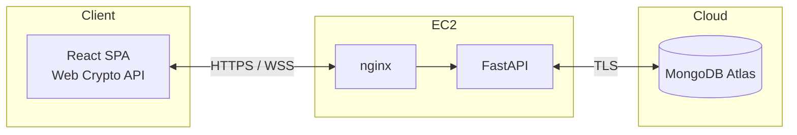
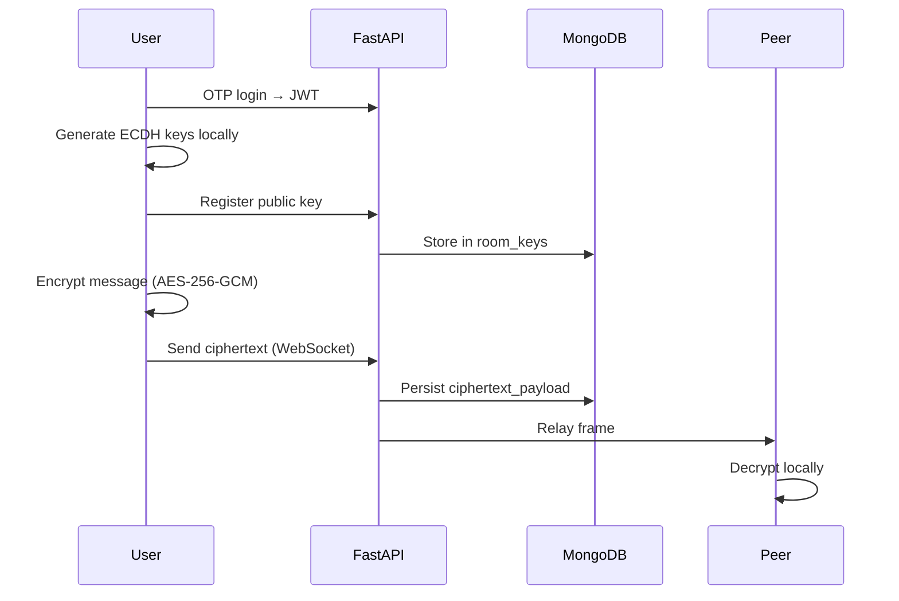

<div align="center">

# StudySafe

**End-to-end encrypted realtime messaging for secure team collaboration**

Messages are encrypted in the browser before they leave the device.  
The server relays ciphertext only — it never sees plaintext.

<br/>

[](https://github.com/Sireesha-Boyapati/Secure-Communications-Collaboration-System-Design-and-Deployment/actions)


<br/>

[**Live Demo**](https://16.16.138.41) · [**API Docs**](https://16.16.138.41/docs) · [**SharePoint**](https://mydbs-my.sharepoint.com/shared?ga=1&id=%2Fpersonal%2F20097954%5Fmydbs%5Fie%2FDocuments%2Fca%20project%20security&listurl=%2Fpersonal%2F20097954%5Fmydbs%5Fie%2FDocuments)

*Mahendra · Sireesha · Oree · Sudheer*

</div>

<br/>

> Production runs on HTTPS with a self-signed certificate. Accept the browser warning once — the Web Crypto API requires a secure context.

---

## Overview

StudySafe is a full-stack secure messaging platform built for teams that need real-time chat without trusting the server with message content.

Mainstream tools store messages in plaintext on third-party infrastructure. StudySafe takes a different approach: **cryptography enforces confidentiality**, not policy. Users sign in with email OTP, join invite-only rooms, and chat in real time — with the same live feel as modern messengers, but with end-to-end encryption built in.

**Design principle:** plaintext must never reach the backend or database.

---

## Features

**Identity & access**
- Passwordless email OTP login with JWT sessions (HS256, 60-minute TTL)
- Invite-only rooms with 6-character codes
- JWT enforced on every REST call and WebSocket connection

**Encrypted messaging**
- ECDH P-256 key agreement + AES-256-GCM via the browser Web Crypto API
- Public keys registered per room; private keys stay in the browser (`sessionStorage`)
- SHA-256 key fingerprints for out-of-band verification

**Realtime collaboration**
- Authenticated WebSocket relay with live presence and typing indicators
- Auto-reconnect with connection status in the UI
- Message history stored as ciphertext and decrypted only when users rejoin

**Production ready**
- Docker Compose on AWS EC2 with nginx TLS termination
- Gmail SMTP for OTP delivery in production
- GitHub Actions CI — pytest, vitest, and build on every push

---

## Architecture



**Client tier** — React 18 handles OTP login, key generation, encrypt/decrypt, and the WebSocket client. Private keys never leave the browser.

**Application tier** — nginx terminates TLS and serves the production build. FastAPI validates JWTs, registers public keys, and relays ciphertext without decryption capability.

**Data tier** — MongoDB Atlas stores users, rooms, public keys, and encrypted messages. Collections hold metadata and ciphertext only.

### Message flow



**Cryptographic steps**

1. User verifies email via OTP → server issues JWT  
2. User creates or joins a room with an invite code  
3. Browser generates ECDH P-256 keys; public key is registered server-side  
4. Sender derives AES-256-GCM keys per recipient and encrypts locally  
5. Server stores and relays ciphertext; peers decrypt with their private keys  

For MITM protection, users compare SHA-256 key fingerprints on a second channel (Zoom, phone, etc.).

---

## Tech stack

**Frontend** — React 18, TypeScript, Vite, Web Crypto API  
**Backend** — Python 3.12, FastAPI, Motor, Pydantic, slowapi  
**Auth** — Email OTP, JWT (python-jose)  
**Realtime** — WebSocket with JWT-authenticated sessions  
**Database** — MongoDB Atlas M0  
**Email** — Gmail SMTP (production) / console log (local dev)  
**Infrastructure** — AWS EC2 t2.micro, Docker Compose, nginx  
**CI** — GitHub Actions  

Full details → [docs/TECH-STACK.md](docs/TECH-STACK.md)

---

## Security

StudySafe assumes the relay and database may be compromised. The goal is **damage limitation** — an attacker who breaks into EC2 or MongoDB still cannot read messages.

**Controls in place**

- TLS on all traffic (HTTPS / WSS)
- Time-limited OTP + short-lived JWT tokens
- Room membership checks on REST and WebSocket
- End-to-end AES-256-GCM — server has no private keys
- Pydantic input validation on all API bodies
- Rate limiting (60 req/min) and 64 KB WebSocket payload cap
- Security headers, honeypot `/api/admin/*` decoy endpoints
- Secrets in `.env` — never committed to source control

**If the server is breached, attackers still cannot**

- Read message plaintext (never stored)
- Derive private keys (never sent to the server)
- Decrypt history without each user's browser session keys
- Join a room without a valid member JWT

**Threat coverage** — server/DB exfiltration, MITM key substitution, stolen JWT, OTP brute force, WebSocket hijacking, API flooding, injection, and invite code guessing are all mitigated through the controls above.

Deep dive → [docs/SECURITY-PLAN.md](docs/SECURITY-PLAN.md)

---

## Quick start

**Prerequisites:** Python 3.12+, Node.js 20+, MongoDB (local or Atlas)

```bash
# Backend
cd backend
python3 -m venv .venv && source .venv/bin/activate
pip install -r requirements-dev.txt
cp .env.example .env          # set MONGODB_URI, JWT_SECRET
uvicorn app.main:app --reload --port 8000

# Frontend (new terminal)
cd frontend && npm install && npm run dev
```

Open **http://localhost:5173** · API docs at **http://localhost:8000/docs**

Without SMTP, OTP codes print in the backend terminal: `[DEV OTP] email=... code=...`

**Two-user test:** use two browsers with **different email addresses**. Join the same room via the **invite code**, not the room display name.

---

## Deploy to AWS

Single EC2 instance running Docker — frontend, backend, and nginx together. Database is MongoDB Atlas (not on EC2).

```bash
git clone https://github.com/Sireesha-Boyapati/Secure-Communications-Collaboration-System-Design-and-Deployment.git
cd Secure-Communications-Collaboration-System-Design-and-Deployment
bash deploy/aws/setup-ec2.sh

cp deploy/aws/env.production.example backend/.env
# Edit: MONGODB_URI, JWT_SECRET, SMTP_*, CORS_ORIGINS=https://YOUR_EC2_IP

bash deploy/aws/generate-selfsigned-cert.sh YOUR_EC2_IP
bash deploy/aws/deploy.sh YOUR_EC2_IP
```

Open **https://YOUR_EC2_IP** · Security group: ports **22** (SSH) and **443** (HTTPS)

Key env vars: `ENVIRONMENT=production`, `CORS_ORIGINS=https://YOUR_EC2_IP`, `JWT_EXPIRE_MINUTES=60`, `SMTP_HOST=smtp.gmail.com`

Full guide → [deploy/aws/DEPLOY-AWS.md](deploy/aws/DEPLOY-AWS.md)

---

## Testing

```bash
cd backend && pytest -v
cd frontend && npm test && npm run build
```

CI runs on every push to `main`.

**Verify encryption works**

1. Padlock icons on messages; check **Encryption & keys** for fingerprints  
2. Two browsers, two different emails — live encrypted chat  
3. MongoDB `messages` collection — `ciphertext_payload` is unreadable JSON  
4. DevTools → WebSocket frames show encrypted payloads, not plain text  
5. `/docs` — no decrypt endpoints exist on the server  

---

## Documentation

- [Project overview](docs/STUDYSAFE.md)
- [Technology stack](docs/TECH-STACK.md)
- [Security plan](docs/SECURITY-PLAN.md)
- [Repository security](docs/REPO-SECURITY.md)
- [Deployment options](docs/DEPLOYMENT-OPTIONS.md)
- [AWS deployment guide](deploy/aws/DEPLOY-AWS.md)
- [Attribution](ATTRIBUTION.md)

---

<div align="center">

**StudySafe** — secure communications platform

Not licensed for commercial use.

</div>
