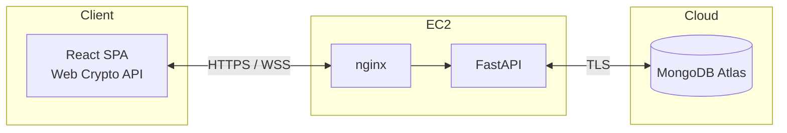
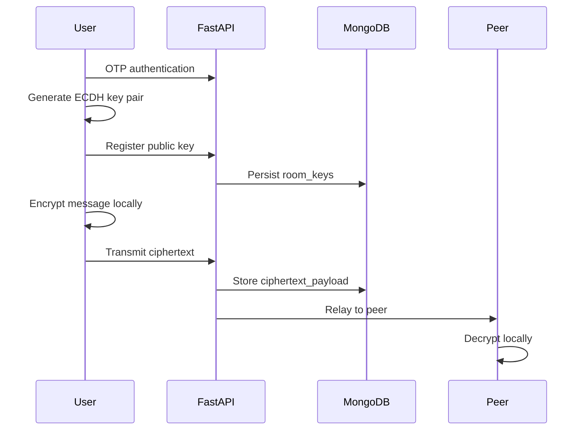

# StudySafe

[](https://github.com/Sireesha-Boyapati/Secure-Communications-Collaboration-System-Design-and-Deployment/actions)


Secure, end-to-end encrypted realtime messaging platform for confidential team collaboration.

Messages are encrypted in the browser before transmission. The server stores and relays ciphertext only; private keys never leave the client device.

**Live demo:** https://16.16.138.41  
**API documentation:** https://16.16.138.41/docs  
**Team workspace:** [DBS SharePoint](https://mydbs-my.sharepoint.com/shared?ga=1&id=%2Fpersonal%2F20097954%5Fmydbs%5Fie%2FDocuments%2Fca%20project%20security&listurl=%2Fpersonal%2F20097954%5Fmydbs%5Fie%2FDocuments)

Development team: Mahendra, Sireesha, Oree, Sudheer

> Production uses HTTPS with a self-signed certificate. Accept the browser security warning once to enable the Web Crypto API.

---

## Overview

StudySafe is a full-stack secure messaging application designed for teams that require real-time communication without delegating confidentiality to the server.

Conventional messaging platforms persist messages on third-party infrastructure, often in plaintext. StudySafe applies client-side cryptography so that confidentiality is enforced by design. Users authenticate via email OTP, join invite-only rooms, and exchange messages in real time with end-to-end encryption comparable to consumer messaging applications.

**Design principle:** plaintext must never reach the backend or database.

---

## Features

### Identity and access control

- Passwordless email OTP authentication with JWT sessions (HS256, 60-minute TTL)
- Invite-only rooms secured with 6-character access codes
- JWT validation on all protected REST endpoints and WebSocket connections

### Encrypted messaging

- ECDH P-256 key agreement and AES-256-GCM encryption via the Web Crypto API
- Per-room public key registration; private keys retained in browser session storage
- SHA-256 key fingerprints for out-of-band verification

### Realtime collaboration

- JWT-authenticated WebSocket relay with presence and typing indicators
- Automatic reconnection with live connection status in the user interface
- Encrypted message history persisted in MongoDB and decrypted on the client

### Production deployment

- Docker Compose on AWS EC2 with nginx TLS termination
- Gmail SMTP for OTP delivery in production environments
- GitHub Actions continuous integration (pytest, vitest, production build)

---

## Architecture



The client tier (React 18) handles authentication, key generation, encryption, decryption, and WebSocket communication. Private keys remain exclusively in the browser.

The application tier (nginx and FastAPI) terminates TLS, validates JWTs, maintains the public key registry, and relays ciphertext without decryption capability.

The data tier (MongoDB Atlas) stores users, rooms, public keys, and encrypted message payloads. No plaintext message content is persisted.

### Message flow



### Cryptographic workflow

1. User verifies identity via email OTP; server issues a JWT.
2. User creates or joins a room using an invite code.
3. Browser generates an ECDH P-256 key pair; the public key is registered server-side.
4. Sender derives AES-256-GCM keys per recipient and encrypts the message locally.
5. Server stores and relays ciphertext; recipients decrypt using their private keys.

Users may verify SHA-256 key fingerprints through an independent channel to detect man-in-the-middle attacks.

---

## Technology stack

### Frontend


React-based chat interface with client-side encryption and WebSocket connectivity.

### Backend


FastAPI REST and WebSocket services with JWT authentication, rate limiting, and ciphertext relay.

### Authentication and realtime


Passwordless authentication, short-lived sessions, and encrypted realtime messaging.

### Data and infrastructure


MongoDB Atlas for encrypted storage; AWS EC2 for production hosting; GitHub Actions for CI.

Further detail: [docs/TECH-STACK.md](docs/TECH-STACK.md)

---

## Security

StudySafe is designed under the assumption that the application server and database may be compromised. The security objective is damage limitation: a breached relay must not expose readable message content.

### Implemented controls

- TLS encryption on all HTTP and WebSocket traffic
- Time-limited OTP codes and short-lived JWT tokens
- Room membership validation on REST and WebSocket requests
- End-to-end AES-256-GCM encryption with client-only private keys
- Pydantic schema validation on all API request bodies
- Rate limiting (60 requests per minute) and 64 KB WebSocket payload limits
- HTTP security headers and honeypot decoy endpoints at `/api/admin/*`
- Secrets managed via environment variables; excluded from version control

### Residual protection after server compromise

An attacker with full access to EC2 and MongoDB cannot:

- Read message plaintext (not stored server-side)
- Derive private keys (never transmitted to the server)
- Decrypt historical messages without each user's browser session keys
- Access a room without a valid JWT for an authorized member

Further detail: [docs/SECURITY-PLAN.md](docs/SECURITY-PLAN.md)

---

## Local development

**Prerequisites:** Python 3.12+, Node.js 20+, MongoDB (local instance or Atlas URI)

```bash
# Backend
cd backend
python3 -m venv .venv && source .venv/bin/activate
pip install -r requirements-dev.txt
cp .env.example .env
uvicorn app.main:app --reload --port 8000

# Frontend (separate terminal)
cd frontend && npm install && npm run dev
```

- Application: http://localhost:5173
- API documentation: http://localhost:8000/docs

Without SMTP configuration, OTP codes are logged to the backend console: `[DEV OTP] email=... code=...`

For multi-user testing, open two browsers with different email accounts and join the same room using the invite code.

---

## AWS production deployment

The production environment runs on a single EC2 instance (Docker Compose: nginx, FastAPI, React). MongoDB Atlas is hosted separately.

```bash
git clone https://github.com/Sireesha-Boyapati/Secure-Communications-Collaboration-System-Design-and-Deployment.git
cd Secure-Communications-Collaboration-System-Design-and-Deployment
bash deploy/aws/setup-ec2.sh

cp deploy/aws/env.production.example backend/.env
bash deploy/aws/generate-selfsigned-cert.sh YOUR_EC2_IP
bash deploy/aws/deploy.sh YOUR_EC2_IP
```

Configure `MONGODB_URI`, `JWT_SECRET`, `SMTP_*`, and `CORS_ORIGINS=https://YOUR_EC2_IP` in `backend/.env`.

Open https://YOUR_EC2_IP. Security group: ports 22 (SSH) and 443 (HTTPS).

Deployment guide: [deploy/aws/DEPLOY-AWS.md](deploy/aws/DEPLOY-AWS.md)

---

## Testing

```bash
cd backend && pytest -v
cd frontend && npm test && npm run build
```

Continuous integration runs on every push to the `main` branch.

### Encryption verification

1. Confirm padlock indicators on messages and review key fingerprints in the Encryption panel.
2. Conduct a live chat session between two distinct user accounts in separate browsers.
3. Inspect the MongoDB `messages` collection; `ciphertext_payload` must contain unreadable JSON.
4. Review WebSocket frames in browser DevTools; payloads must not contain plaintext.
5. Confirm the OpenAPI documentation exposes no message decryption endpoints.

---

## Documentation

- [Project overview](docs/STUDYSAFE.md)
- [Technology stack](docs/TECH-STACK.md)
- [Security plan](docs/SECURITY-PLAN.md)
- [Repository security](docs/REPO-SECURITY.md)
- [Deployment options](docs/DEPLOYMENT-OPTIONS.md)
- [AWS deployment guide](deploy/aws/DEPLOY-AWS.md)
- [Attribution](ATTRIBUTION.md)

---

## License

StudySafe secure communications platform. Not licensed for commercial use.
