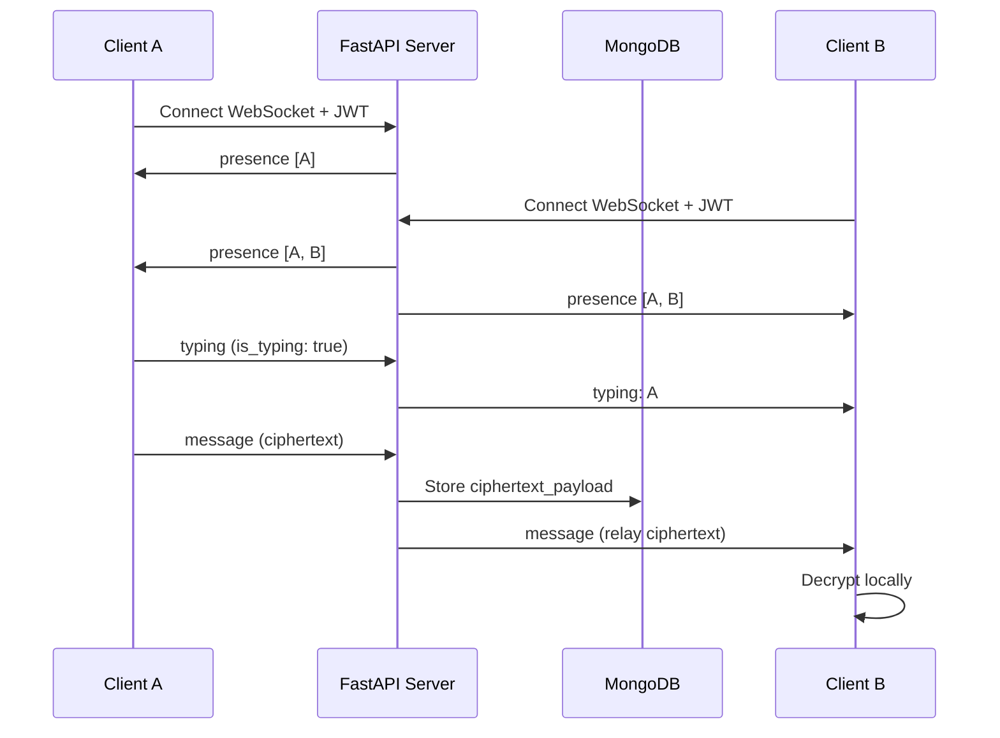

# StudySafe — Realtime WebSocket Architecture

Production-grade realtime encrypted chat over authenticated WebSockets.

---

## Realtime features

| Feature | Protocol | Encrypted? | Storage |
|---------|----------|------------|---------|
| Encrypted messages | WebSocket `type: message` | Yes (AES-256-GCM) | MongoDB ciphertext |
| Online presence | WebSocket `type: presence` | No (usernames only) | In-memory only |
| Typing indicators | WebSocket `type: typing` | No (metadata only) | Not stored |
| Join/leave events | WebSocket `type: system` | No | Not stored |
| Auto-reconnect | Client-side | — | — |

---

## WebSocket flow

Two clients in the same room. The server authenticates each connection, broadcasts presence, relays typing metadata, and stores/relays encrypted messages without decrypting them.

### Event summary

| Step | Direction | Event | Notes |
|------|-----------|-------|-------|
| 1 | A → Server | WebSocket connect | JWT in query string; room membership verified |
| 2 | Server → A | `presence` | Online list: `[A]` |
| 3 | B → Server | WebSocket connect | Same JWT + membership checks |
| 4 | Server → A, B | `presence` | Broadcast: `[A, B]` |
| 5 | A → Server | `typing` | Metadata only; username from JWT |
| 6 | Server → B | `typing` | Relay: user A is typing |
| 7 | A → Server | `message` | Encrypted payload only |
| 8 | Server → MongoDB | persist | Ciphertext stored; no plaintext |
| 9 | Server → B | `message` | Relay same ciphertext frame |
| 10 | B (local) | decrypt | AES-256-GCM using ECDH shared secret |

Event type constants: `backend/app/websocket/events.py`

---

## Security notes

- **Messages:** Always encrypted client-side before WebSocket send
- **Typing/presence:** Metadata only — no message content exposed
- **JWT required:** WebSocket rejected without valid token (close code 4001)
- **Room membership:** Non-members cannot connect (close code 4003)
- **Reconnect:** Client retries with exponential backoff

---

## Code locations

| Component | File |
|-----------|------|
| WebSocket endpoint | `backend/app/main.py` |
| Connection manager | `backend/app/websocket/manager.py` |
| Event types | `backend/app/websocket/events.py` |
| Realtime client | `frontend/src/lib/websocket.ts` |
| Chat UI | `frontend/src/components/chat/ChatRoom.tsx` |
| Online users | `frontend/src/components/chat/OnlineUsers.tsx` |
| Typing indicator | `frontend/src/components/chat/TypingIndicator.tsx` |

---

## Related documentation

- Root [README.md](../README.md) — system architecture and cryptographic workflow
- [docs/TECH-STACK.md](TECH-STACK.md) — full technology stack
- [docs/SECURITY-PLAN.md](SECURITY-PLAN.md) — trust model and controls
