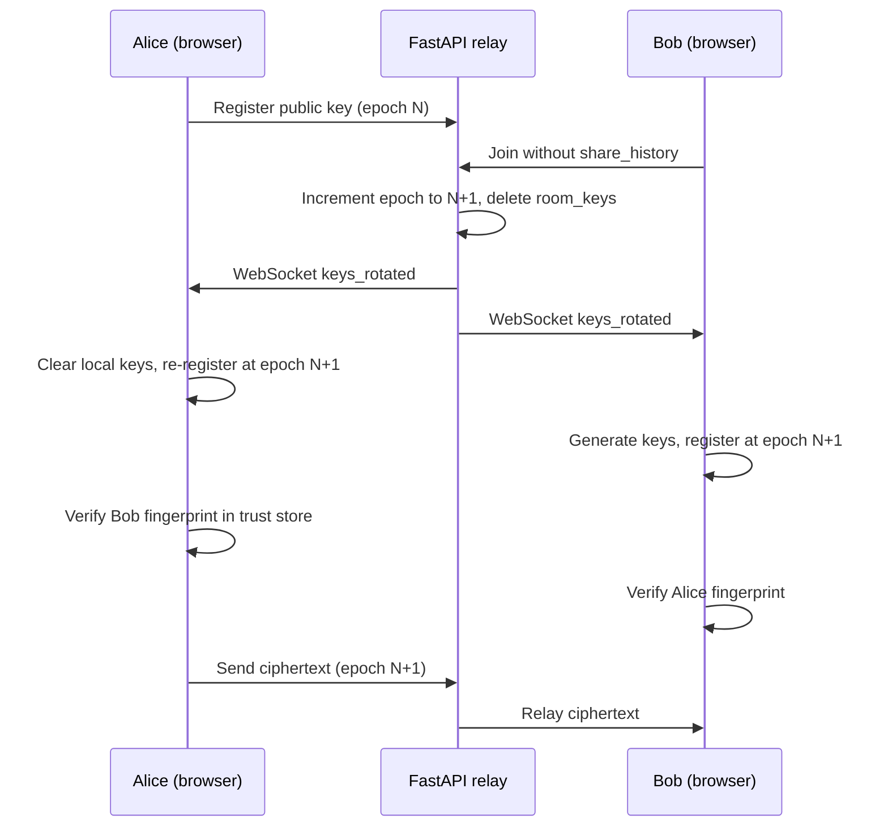

# StudySafe — Security Plan

Implementation security model for StudySafe. The full threat analysis is in the root [README.md](../README.md).

---

## Trust model

| Trusted | Not trusted |
|---------|-------------|
| Browser, Web Crypto API, TLS | AWS server, MongoDB, network (except TLS) |
| Email OTP delivery channel | External GitHub users without repo access |

---

## Security layers

1. **E2E encryption (client)** — primary confidentiality control
2. **Trust verification (client)** — fingerprint verification before send; local trust store per room/user
3. **Crypto epoch rotation (server + client)** — key material invalidated on membership change
4. **JWT authentication** — API and WebSocket access
5. **Rate limiting** — brute-force and abuse prevention
6. **GitHub branch protection** — repository integrity
7. **CODEOWNERS** — mandatory review on security-sensitive files
8. **Honeypot decoy** — reconnaissance detection
9. **Docker service isolation** — limits blast radius between services

---

## Golden rule

```
Plaintext must NEVER reach backend/ or MongoDB
```

---

## Repository access

Only Mahendra, Sireesha, Oree, and Sudheer may push code. See [REPO-SECURITY.md](REPO-SECURITY.md) for GitHub setup.

| Control | Status | Reference |
|---------|--------|-----------|
| Limit collaborators to team | Manual setup | [REPO-SECURITY.md](REPO-SECURITY.md) |
| Branch protection on `main` | Manual setup | [REPO-SECURITY.md](REPO-SECURITY.md) |
| CODEOWNERS auto-review | Implemented | `.github/CODEOWNERS` |
| CI must pass before merge | Implemented | `.github/workflows/ci.yml` |

---

## Application attack prevention

| Attack | Protection | Location |
|--------|------------|----------|
| Brute-force OTP | Rate limit | `backend/app/security/rate_limit.py` |
| API flooding | 60 req/min default | `backend/app/security/rate_limit.py` |
| Unauthorized API access | JWT on protected routes | `backend/app/auth/dependencies.py` |
| WebSocket hijacking | JWT + room membership | `backend/app/main.py` |
| Reconnaissance | Honeypot `/api/admin/*` | `backend/app/security/honeypot.py` |
| XSS / clickjacking | Security headers | `backend/app/security/middleware.py` |
| Server data breach | E2E — ciphertext only | `frontend/src/lib/crypto.ts` |
| MITM key substitution | Client trust store + verify-before-send | `frontend/src/lib/trustStore.ts` |
| Stale keys after member leaves | Crypto epoch + server key wipe | `backend/app/services/room_service.py` |
| Fake public key re-registration | Epoch-scoped registration + KEY_CHANGE audit | `backend/app/routers/rooms.py` |
| Large payload DoS | 64 KB WebSocket cap | `backend/app/main.py` |
| Injection | Pydantic validation | `backend/app/models/schemas.py` |

---

## Key trust and rotation model



**Client trust store** (`localStorage`): per room/user/fingerprint — statuses `unverified`, `verified`, `changed`.  
**Send gate:** `ChatRoom` blocks compose until `allPeersVerified()`.

---

| Control | Action |
|---------|--------|
| SSH | Key-based only; disable password login |
| Security groups | Allow 443 (HTTPS) and 22 (SSH from admin IP only) |
| Secrets | `JWT_SECRET`, `MONGODB_URI` in `.env` — never in git |
| TLS | HTTPS on nginx (self-signed for demo; Let's Encrypt for production) |
| MongoDB | Atlas IP whitelist — EC2 public IP only |
| Logs | Monitor honeypot triggers in application logs |
