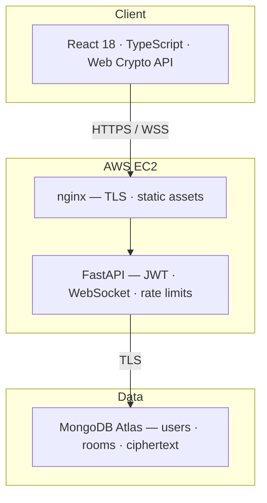

# StudySafe — Technology Stack

**Last updated:** July 2026

---

## Architecture overview

---

## Frontend

| Component | Technology | Purpose |
|-----------|------------|---------|
| Framework | React 18 | Chat UI, routing, state |
| Language | TypeScript 5 | Type-safe crypto and API integration |
| Build | Vite 5 | Dev server and production bundle |
| Cryptography | Web Crypto API | ECDH P-256, AES-256-GCM, SHA-256 |
| Realtime | WebSocket API | Live message relay |
| HTTP | fetch API | REST calls (auth, rooms, keys) |

---

## Backend

| Component | Technology | Purpose |
|-----------|------------|---------|
| Language | Python 3.12 | Application runtime |
| Framework | FastAPI 0.115+ | REST + WebSocket, OpenAPI docs |
| Server | Uvicorn | ASGI production server |
| Validation | Pydantic v2 | Request/response schemas |
| Auth | python-jose + JWT | Session tokens after OTP |
| Email | Gmail SMTP / AWS SES | OTP delivery |
| Database driver | Motor 3.x | Async MongoDB access |
| Config | pydantic-settings | Environment variables |
| Rate limiting | slowapi | Abuse prevention |

---

## Database

| Component | Technology | Purpose |
|-----------|------------|---------|
| Database | MongoDB Atlas M0 | Users, rooms, keys, ciphertext messages |
| Collections | `users`, `otp_codes`, `rooms`, `room_keys`, `messages` | See [FOLDER-STRUCTURE.md](FOLDER-STRUCTURE.md) |

**Stored on server:** public keys, ciphertext, metadata  
**Never stored:** private keys, plaintext messages

---

## Cryptography (client-side only)

| Operation | Algorithm | Notes |
|-----------|-----------|-------|
| Key agreement | ECDH P-256 | Web Crypto `generateKey` |
| Encryption | AES-256-GCM | Per-recipient ciphertext |
| Fingerprint | SHA-256 | Truncated public-key hash for verification |
| Transport | TLS | HTTPS and WSS on EC2 |

---

## Infrastructure

| Service | Purpose |
|---------|---------|
| AWS EC2 (t2.micro) | Docker Compose — nginx, FastAPI, React build |
| MongoDB Atlas | Managed database (TLS) |
| Gmail SMTP | Production OTP email |
| GitHub Actions | CI — pytest, vitest, build on push to `main` |
| Docker Compose | Local development and production packaging |

---

## Development tools

| Tool | Purpose |
|------|---------|
| Node.js 20 LTS | Frontend development |
| Python 3.12 | Backend development |
| pytest / vitest | Automated tests |
| Chrome DevTools | WebSocket and network inspection |
